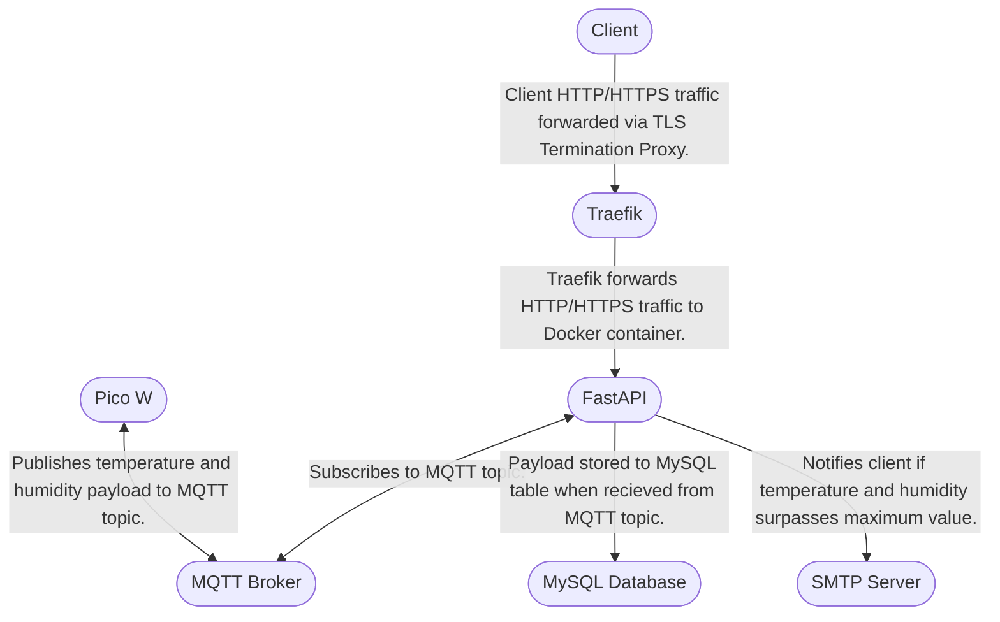

## Vault API
For the Information Assurance (ITT-380) course at [Grand Canyon University](https://gcu.edu), students were tasked with protecting a snack-sized chocolate bar. The student who most creatively maintains the integrity of this chocolate bar will receive extra points. The catch is that students must present this chocolate bar whenever requested by the professor. Since Grand Canyon University is located in Phoenix, Arizona, where temperatures can surpass 110 degrees Fahrenheit, chocolate melting is a major issue. To combat this issue, I created the Vault. The Vault is a cloud application and embedded system that monitors the environment of an enclosure. The embedded system sends temperature and humidity data via MQTT to a FastAPI application in the cloud. This data is then stored in a MySQL database and later displayed on graphs on an analytical frontend. If the temperature or humidity surpasses a configurable amount, a notification is sent via SMTP. 

Learn more about the embedded system [here](https://github.com/itsconnorgillespie/Vault-Firmware).

### Disclaimer

This application was created in under one week. With this in mind, there is no guarantee that the following application is secure or bug-free. If you encounter a bug in the application, feel free to submit an Issue and I will attempt to fix it as soon as possible. Thanks for understanding. 

### Flowchart

The following flowchart aims to illustrate the logical design of the application. This flowchart was employed to plan the communication protocols found within the Vault application. 

### Traefik 

[Traefik](https://traefik.io/traefik/) is a lightweight reverse proxy and load balancer written in GO. By deploying the FastAPI application behind a Traefik proxy, all HTTP traffic can be redirected to HTTPS automatically, leading to an increase in security. Although it is not necessary to deploy the Vault application, I highly recommend doing your research and deploying with Traefik. 

## License
[Vault-API](https://github.com/connorgillespie/Vault-API) © 2019 by [Connor Gillespie](https://github.com/connorgillespie) is licensed under [CC BY-NC-ND 4.0](http://creativecommons.org/licenses/by-nc-nd/4.0/?ref=chooser-v1)  
